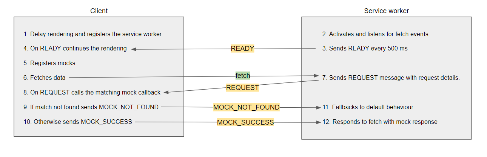

# Mock API

## API

### type MockMethod

```ts
'GET' | 'POST' | 'DELETE' | 'PUT';
```

### type MockRequest

```ts
{
    url: string;
    method: MockMethod;
    headers: Record<string, string | string[]>;
    body?: unknown;
    params: Record<string, string>;
    query: Record<string, string | string[]>;
}
```

### type MockResponse

```ts
{
    status: (statusCode: number) => void;
    delay: (delayMs: number) => void;
    mockError: (enable: boolean) => void;
    mockHTML: (enable: boolean) => void;
}
```

### type Mock

```ts
{
    path: string;
    method?: MockMethod;
    callback: (req: MockRequest, res: MockResponse) => Promise<unknown | undefined> | unknown | undefined;
}
```

### enableNodeMockApi() => void

Used internally by `dev-tools` Jest configuration

### enableSwMockApi() => Promise<void>

Used internally by `WaitForMockApi` Storybook configuration and manually in application index.ts

### registerApiMocks(newMocks: Mock[]) => void

Example

```ts
export function setupApiMocks(): void {
  registerApiMocks([
    {
      path: '/api/friends',
      callback: getFriends,
    },
    {
      path: '/api/friends/:id/add-to-favorite',
      method: 'POST',
      callback: addToFavorite,
    },
    {
      path: '/api/friends/:id/remove-from-favorite',
      method: 'POST',
      callback: removeFromFavorite,
    },
  ]);
}
```

### setMockSwitch(switchName: string, value: string) => void

Switches a mock switch. Wrapper function is normally used in storybook stories and tests

Example

```ts
export enum FriendsMockSwitch {
  NORMAL = 'NORMAL',
  EMPTY = 'EMPTY',
  SLOW = 'SLOW',
  LOADING_FAILURE = 'LOADING_FAILURE',
  PROCESSING_FAILURE = 'PROCESSING_FAILURE',
}

export function setFriendsMockSwitch(mockSwitch: FriendsMockSwitch): void {
  setMockSwitch('friends', mockSwitch);
}

export function getFriendsMockSwitck(): FriendsMockSwitch {
  return getMockSwitch('friends') as FriendsMockSwitch;
}
```

### getMockSwitch(switchName: string) => string;

Wrapper function is normally used in API mock callbacks

### clearMockSwitches() => void;

Used internally in `dev-tools` Jest configuration as `beforeEach`

### saveInMockDB<T>(key: string, value: T) => void;

Basic key, value pair storage. Persist a value in mock "backend". Based on `SessionStorage`.
Used in API mock callbacks

Example

```ts
function getFavorites(): string[] {
  return loadFromMockDB('friend-favories') ?? ['enrico', 'michelle'];
}

function setFavorites(favorites: string[]): void {
  saveInMockDB('friend-favories', favorites);
}

function addToFavorite({ params }: MockRequest, response: MockResponse) {
  setFavorites([...getFavorites(), params.id]);
}
```

### loadFromMockDB<T>(key: string) => T;

Retrieve value from key, value pair storage

### clearMockDB() => void;

Clear key, value storage.
Used internally in `dev-tools` Jest configuration as `beforeEach`

### setMockApiDelay(delay: number) => void;

Set a global delay to calls. Usefull for simulating real UX.
Used internally in Storybook configuration manually in application index.ts

### WaitForMockApi: FC;

React component which delays the rendering of children until the service worker is ready to handle requests.
Used internally in Storybook configuration manually in application index.ts

```ts
function renderApp(): ReactNode {
  const app = <App />;

  if (process.env.REACT_APP_USE_MOCK_API !== 'true') {
    return app;
  }

  setupApiMocks();
  setMockApiDelay(750);
  return <WaitForMockApi>{app}</WaitForMockApi>;
}

ReactDOM.render(
  <React.StrictMode>{renderApp()}</React.StrictMode>,
  document.getElementById('root')
);
```

## Flow

1. Client delays rendring of content, registers the service worker. And start listening for `READY` and `REQUEST` messages. [code](https://github.com/mucsi96/react-large-project-demo/blob/3e162453e7ea3cbc2d7aea4981cd1748af2f14fc/packages/mock-api/src/WaitForMockApi.tsx#L8)
2. Service worker activates and starts listening for `fetch` events. [code](https://github.com/mucsi96/react-large-project-demo/blob/3e162453e7ea3cbc2d7aea4981cd1748af2f14fc/packages/dev-tools/src/mockApi/mockApiServiceWorker.ts#L6)
3. Service worker sets up an interval to send a `READY` event every 500 miliseconds for any new joining client. Unregisters itself if no clients are found. [code](https://github.com/mucsi96/react-large-project-demo/blob/3e162453e7ea3cbc2d7aea4981cd1748af2f14fc/packages/dev-tools/src/mockApi/mockApiServiceWorker.ts#L27)
4. Client receives the `READY` message and continues with rendering the content
5. Client registers some mocks sing `registerApiMocks` [code](https://github.com/mucsi96/react-large-project-demo/blob/3e162453e7ea3cbc2d7aea4981cd1748af2f14fc/packages/mock-api/src/mocks.ts#L8)
6. Client fetches some data.
7. Service worker receives a `fetch` event and sends a `REQUEST` message to the same client. [code](https://github.com/mucsi96/react-large-project-demo/blob/3e162453e7ea3cbc2d7aea4981cd1748af2f14fc/packages/dev-tools/src/mockApi/mockApiServiceWorker.ts#L14)
8. Client receives the `REQUEST` message and calls the matching callback in previously registered mocks. [code](https://github.com/mucsi96/react-large-project-demo/blob/3e162453e7ea3cbc2d7aea4981cd1748af2f14fc/packages/mock-api/src/swMockApi.ts#L38)
9. If there were no matching mock callback found client sends a `MOCK_NOT_FOUND` message to service worker. [code](https://github.com/mucsi96/react-large-project-demo/blob/3e162453e7ea3cbc2d7aea4981cd1748af2f14fc/packages/mock-api/src/swMockApi.ts#L61)
10. Otherwise it sends the result of callback to in `MOCK_SUCCESS` message to service worker. [code](https://github.com/mucsi96/react-large-project-demo/blob/3e162453e7ea3cbc2d7aea4981cd1748af2f14fc/packages/mock-api/src/swMockApi.ts#L75)
11. On `MOCK_NOT_FOUND` message the service worker fallbacks to default behavior and starts fetching data from server. [code](https://github.com/mucsi96/react-large-project-demo/blob/3e162453e7ea3cbc2d7aea4981cd1748af2f14fc/packages/dev-tools/src/mockApi/mockApiServiceWorker.ts#L75)
12. Otherwise it respons to the request with mock response included in the message. [code](https://github.com/mucsi96/react-large-project-demo/blob/3e162453e7ea3cbc2d7aea4981cd1748af2f14fc/packages/dev-tools/src/mockApi/mockApiServiceWorker.ts#L79)



## Debug

1. FriendList.stories.tsx:16
2. setupApiMocks.js:13
3. mocks.js:10
4. FriendList.stories.tsx:17
5. useFriends.ts:27
6. useApi.js:15
7. friends.js:5
8. mockApiServiceWorker.js:4
9. mockApiServiceWorker.js:49
10. swMockApi.js:19
11. swMockApi.js:39
12. mockApiServiceWorker.js:59
13. handleJSONResponse.js:3
14. friends.js:20
15. useApi.js:20
16. apiReducer.js:2
17. useApi.js:30
18. useFriends.ts:55
